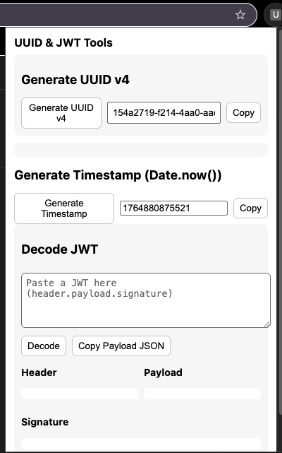

# Installing

1. Put the files into a folder (e.g. uuid-jwt-extension).

2. In Chrome go to chrome://extensions, enable Developer mode.

3. Click Load unpacked and choose the folder.

4. Click the toolbar action to open the popup.

# Screenshots

